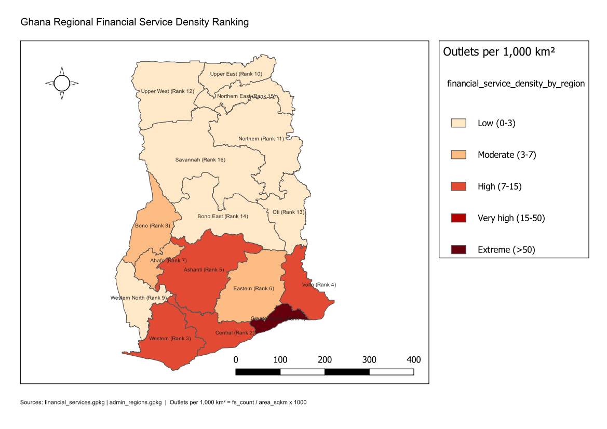

# Regional Financial Service Density Ranking

**Country:** Ghana
**CRS:** EPSG:25000 - Leigon / Ghana Metre Grid
**Project file:** `Regional_Financial_Service_Density_Ranking.qgz`

---

## Overview

This project ranks all 16 administrative regions of Ghana by the density of financial service outlets, normalised by regional area (outlets per sq km). The analysis provides a comparable measure of financial service provision intensity across regions of widely varying size, supporting investment targeting and financial inclusion gap identification.

## Reference Layout

---

## Objectives

- Count all financial service outlets per administrative region.
- Normalise counts by region area to produce a density value (outlets per sq km).
- Rank regions from highest to lowest density and assign a density rank attribute.

## Methodology

1. Financial services (banks, ATMs, post offices, mobile money agents, bureaux de change, money transfer outlets, microfinance institutions) spatially joined to administrative region polygons.
2. Count per region calculated and region area computed in square kilometres.
3. Financial service density calculated as: `fs_count / area_sqkm`.
4. Regions ranked 1-16 descending by density.
5. Output stored in `financial_service_density_by_region.gpkg` with rank and density attributes.

## Output Layers

| File | Description |
|------|-------------|
| `financial_service_density_by_region.gpkg` | Administrative regions with financial service count, area, density value, and rank |

## Density Ranking Results

| Rank | Region | Total Outlets | Area (sq km) | Density (per sq km) |
|------|--------|--------------|--------------|---------------------|
| 1 | Greater Accra | 1,279 | 3,699 | 345.74 |
| 2 | Central | 143 | 9,664 | 14.80 |
| 3 | Western | 180 | 14,258 | 12.62 |
| 4 | Volta | 117 | 9,825 | 11.91 |
| 5 | Ashanti | 258 | 24,379 | 10.58 |
| 6 | Eastern | 132 | 18,966 | 6.96 |
| 7 | Ahafo | 31 | 5,195 | 5.97 |
| 8 | Bono | 44 | 11,647 | 3.78 |
| 9 | Western North | 28 | 10,075 | 2.78 |
| 10 | Upper East | 22 | 8,622 | 2.55 |
| 11 | Northern | 53 | 24,849 | 2.13 |
| 12 | Upper West | 37 | 19,033 | 1.94 |
| 13 | Oti | 15 | 11,066 | 1.36 |
| 14 | Bono East | 26 | 23,256 | 1.12 |
| 15 | Northern East | 5 | 9,075 | 0.55 |
| 16 | Savannah | 10 | 35,863 | 0.28 |

**National mean density:** 26.57 per sq km
**Median density:** 3.28 per sq km

## Key Findings

- Greater Accra's density (345.74 per sq km) far exceeds any other region; it accounts for the dominant share of national financial service infrastructure.
- Nine regions fall below the national median density, with Savannah, Northern East, and Bono East ranking as the most financially underserved on a density basis.
- Outlet type breakdown shows Greater Accra holds disproportionate ATM and bank branch concentration, while mobile money agents and post offices provide the primary formal access channels in northern regions.

## Deliverables

| File | Type |
|------|------|
| `Regional_Financial_Service_Density_Ranking.qgz` | QGIS project |
| `Financial_Service_Density_Ranking.pdf` | Exported map layout |
| `reference_layout.png` | Print layout reference image |

## Notes

- All layers use EPSG:25000 (Leigon / Ghana Metre Grid).
- This layer is produced alongside and complements the National Infrastructure Completeness Dashboard project in the same date folder.

---

## Map Preview

